  

  <a href="https://pranitkatwe.vercel.app/"><code>portfolio</code></a>
  &nbsp;·&nbsp;
  <a href="https://linkedin.com/in/pranit-katwe"><code>linkedin</code></a>
  &nbsp;·&nbsp;
  <a href="mailto:pranitskatwe@gmail.com"><code>email</code></a>

| Instance | Description | Stack |
|---|---|---|
| **[Filing-Delta Event Signal](https://github.com/PranitKatwe/equity-filing-delta)** · [live](https://equity-filing-delta.vercel.app/) | Point-in-time event study: do changes in SEC 10-K risk-factor text predict abnormal returns? 480 S&P 500 companies, 4,705 filings, strict no-lookahead design, grounded LLM narrator. Honest verdict: real but weak, dies after costs. *"The chart goes nowhere. That's the point."* | Python · statsmodels · SEC EDGAR · Claude API · Vercel |
| **[Repo Oracle](https://github.com/PranitKatwe/repo-oracle)** | 6-tool MCP server letting LLMs query GitHub repos inside Cursor IDE — PR risk detection, recursive tree scanner, ~40% fewer redundant API calls. Built at Cursor Hackathon Denver 2025. | Python · FastMCP · GitHub API |
| **[DocSumAI](https://github.com/PranitKatwe/DocSumAI-LLM-Powered-Summary)** | Cloud LLM document summarization — PDF/DOCX/TXT, 10K+ word docs via token-safe chunking, response time cut 10s → 6s. | Flask · GCP Pub/Sub · BART · GPT-4o · Docker |
| **[SBA Loan Eligibility](https://github.com/PranitKatwe/ai-driven-sba-loan-eligibility-system)** | Stacked ensemble with 30%+ minority-class recall improvement and SHAP/LIME explainability. | XGBoost · LightGBM · TabTransformer · SHAP |
| **[Ray — open source contrib](https://github.com/PranitKatwe/ray)** | Resolved `ArrowNotImplementedError` enabling PyArrow compatibility in Ray Datasets; duplicate-removal API used in large-scale ML preprocessing. | Python · PyArrow · Distributed Computing |

Earlier checkpoints

 

- **[UniPredict — Admission Analytics](https://github.com/PranitKatwe/UniPredict-Admission-Analytics)** — 7 GLMs compared via MSPE (R²=0.80); CGPA (r=0.72) and LOR top predictors
- **[ShopTalk — E-commerce Sentiment](https://github.com/PranitKatwe/ShopTalk-E-commerce-Sentiment-Analysis)** — 23K+ reviews, LR vs SVM benchmark, 95% accuracy
- **[Breast Cancer Neural Classifier](https://github.com/PranitKatwe/Breast-Cancer-Neural-Classifier)** — neural classification on diagnostic data
- **[SteamPlay Recommender](https://github.com/PranitKatwe/ML-Project)** — game recommendation system
- **[ElectroMobility Dashboard](https://github.com/PranitKatwe/ElectroMobility-Dashboard-)** — Power BI, 7 years of EV adoption across 300+ U.S. counties

  <b>Endpoint:</b> <a href="mailto:pranitskatwe@gmail.com">pranitskatwe@gmail.com</a>
  &nbsp;·&nbsp;
  <b>Docs:</b> <a href="https://pranitkatwe.vercel.app/">pranitkatwe.vercel.app</a>
  &nbsp;·&nbsp;
  <b>Changelog:</b> <a href="https://sites.google.com/view/pranit-katwe/professional-background">My Learning Vault</a>
  &nbsp;·&nbsp;
  <b>Archived talks:</b> <a href="https://www.youtube.com/@nerdcast_nerdcasm">@nerdcast_nerdcasm</a>

